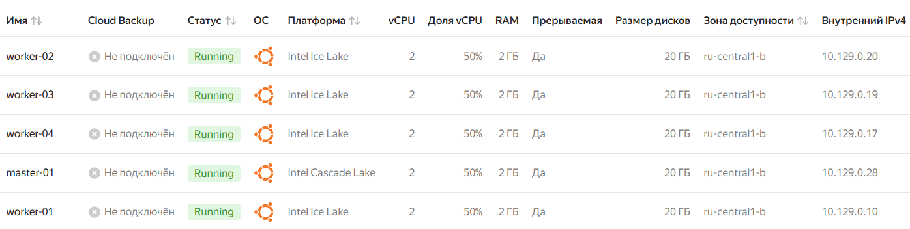
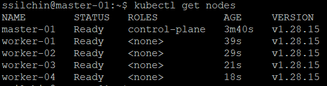
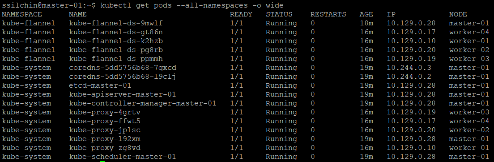

# Домашнее задание к занятию «Установка Kubernetes» Крюков Николай Сергеевич

### Цель задания

Установить кластер K8s.

### Чеклист готовности к домашнему заданию

1. Развёрнутые ВМ с ОС Ubuntu 20.04-lts.


### Инструменты и дополнительные материалы, которые пригодятся для выполнения задания

1. [Инструкция по установке kubeadm](https://kubernetes.io/docs/setup/production-environment/tools/kubeadm/create-cluster-kubeadm/).
2. [Документация kubespray](https://kubespray.io/).

-----

### Задание 1. Установить кластер k8s с 1 master node

1. Подготовка работы кластера из 5 нод: 1 мастер и 4 рабочие ноды.
2. В качестве CRI — containerd.
3. Запуск etcd производить на мастере.
4. Способ установки выбрать самостоятельно.


**Решение**  

1. Для установки кластера k8s был выбран kubeadm, разворачиваем ВМ в облаке яндекса:  

  

Устанавливаем зависимости и необходимые пакеты командами:  

```
apt install apt-transport-https ca-certificates curl  
sudo curl -fsSLo /usr/share/keyrings/kubernetes-archive-keyring.gpg https://packages.cloud.google.com/apt/doc/apt-key.gpg  
echo "deb [signed-by=/usr/share/keyrings/kubernetes-archive-keyring.gpg] https://apt.kubernetes.io/ kubernetes-xenial main" | sudo tee /etc/apt/sources.list.d/kubernetes.list
apt install kubelet kubeadm kubectl containerd
```

2. Далее на master-ноде выполняем команду инициализации:  

```kubeadm init --pod-network-cidr=10.244.0.0/16 --upload-certs --control-plane-endpoint=10.129.0.28```  

где 10.129.0.28 - IP-адрес хоста.  
После инициализации необходимо выполнить копирование конфигурации в папку пользователя:  

  ```
  mkdir -p $HOME/.kube  
  sudo cp -i /etc/kubernetes/admin.conf $HOME/.kube/config  
  sudo chown $(id -u):$(id -g) $HOME/.kube/config  
  ```

3. Также на мастере необходимо установить сетевой плагин flannel командой:  

   ```kubectl apply -f https://raw.githubusercontent.com/coreos/flannel/master/Documentation/kube-flannel.yml```
   
5. Присоединяем worker'ы к кластеру командой (токены были сгенерированы при инициализации master'a):    

```kubeadm join 10.129.0.28:6443 --token mq04td.rg6hoxg68untaeq7 --discovery-token-ca-cert-hash sha256:975a6b17b2ec1619d74ff73e309b3a63072f86b276bbd5381685dc6d92c343c1```  

6. Проверяем командой ```kubectl get nodes```, что ноды успешно присоединились к кластеру:  

  

и проверим все поды в кластере командой ```kubectl get pods --all-namespaces -o wide```:  




