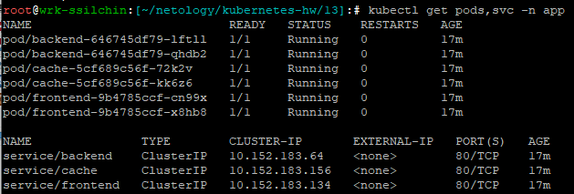
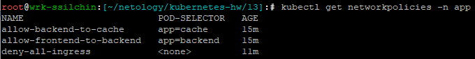
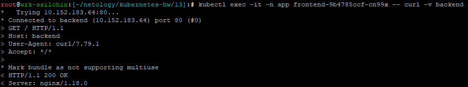
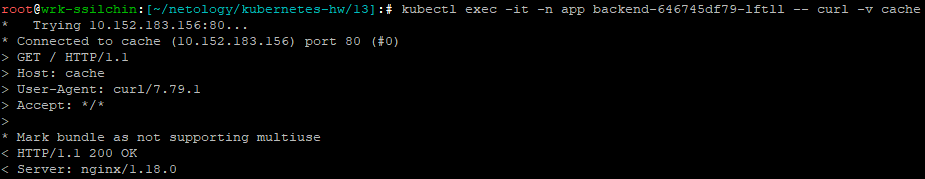
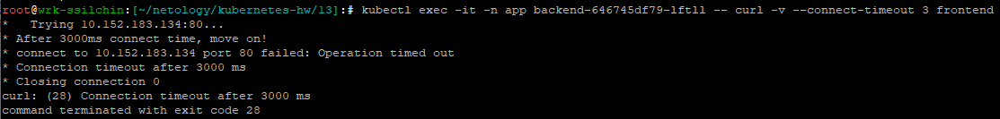
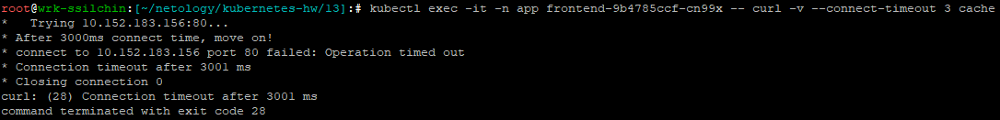
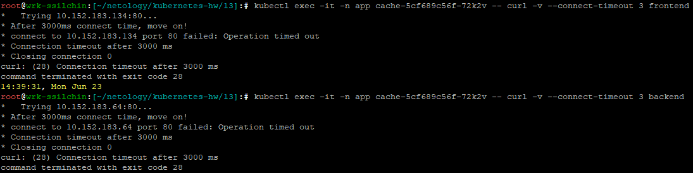

# Домашнее задание к занятию «Как работает сеть в K8s» Крюков Николай Сергеевич

### Цель задания

Настроить сетевую политику доступа к подам.

### Чеклист готовности к домашнему заданию

1. Кластер K8s с установленным сетевым плагином Calico.

### Инструменты и дополнительные материалы, которые пригодятся для выполнения задания

1. [Документация Calico](https://www.tigera.io/project-calico/).
2. [Network Policy](https://kubernetes.io/docs/concepts/services-networking/network-policies/).
3. [About Network Policy](https://docs.projectcalico.org/about/about-network-policy).

-----

### Задание 1. Создать сетевую политику или несколько политик для обеспечения доступа

1. Создать deployment'ы приложений frontend, backend и cache и соответсвующие сервисы.
2. В качестве образа использовать network-multitool.
3. Разместить поды в namespace App.
4. Создать политики, чтобы обеспечить доступ frontend -> backend -> cache. Другие виды подключений должны быть запрещены.
5. Продемонстрировать, что трафик разрешён и запрещён.

**Решение**  
1. Создаем deployment'ы:

[**frontend-deployment.yaml**](./frontend-deployment.yaml),
[**backend-deployment.yaml**](./backend-deployment.yaml),
[**cache-deployment.yaml**](./cache-deployment.yaml)  

  Создаем сервисы:

[**frontend-service.yaml**](./main/frontend-service.yaml),
[**backend-service.yaml**](./backend-service.yaml),
[**cache-service.yaml**](./cache-service.yaml)


2. Создаем namespace командой ```kubectl create namespace app``` и применяем созданные deployment'ы и сервисы.  
   Проверяем, что все создалось, командой ```kubectl get pods,svc -n app```:  



3. Создаем сетевые политики:

[**front-to-back-netpolicy.yaml**](./front-to-back-netpolicy.yaml),
[**back-to-cache-netpolicy.yaml**](./back-to-cache-netpolicy.yaml),

и общую запрещающую политику
[**deny-all-ingress.yaml**](./deny-all-ingress.yaml) и применяем их.  

  Проверяем, что все создалось, командой ```kubectl get networkpolicies -n app```:  



4. Проверим, что доступы из подов frontend в backend и из backend в cache разрешены:  




   Убедимся, что другие виды подключений запрещены:
    - из backend в frontend:  


    - из frontend в cache:  


    - из cache в frontend и backend:  

