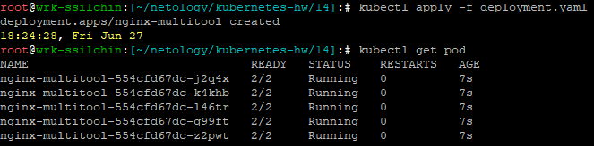
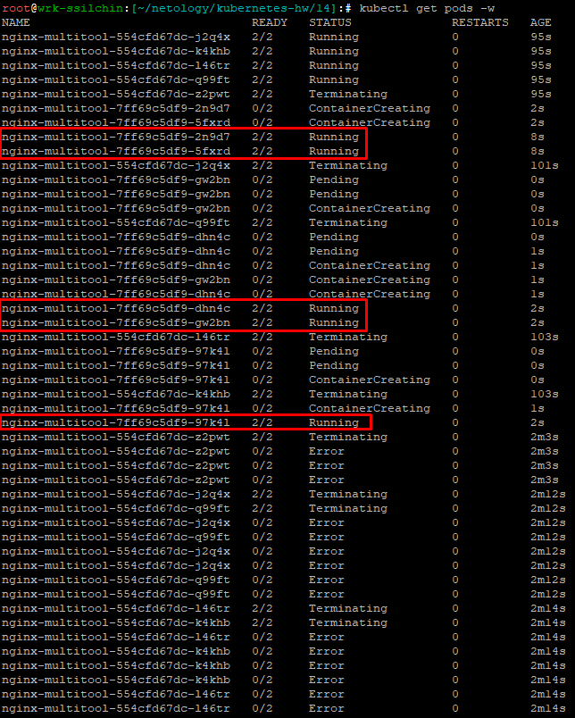
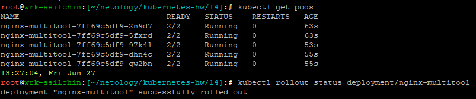
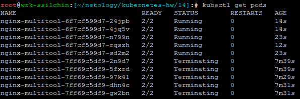
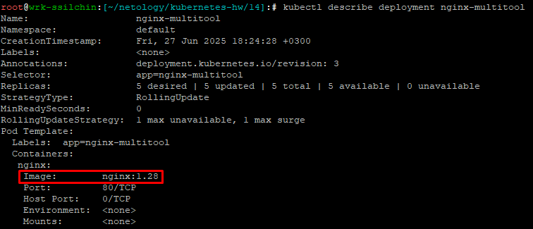
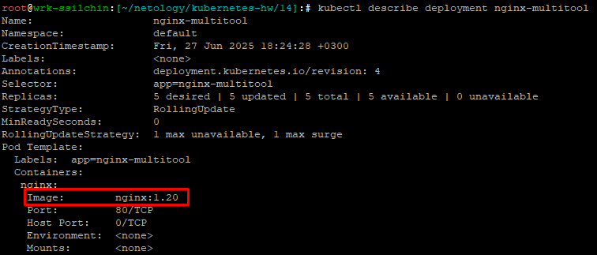
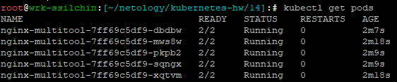

# Домашнее задание к занятию «Обновление приложений» Крюков Николай Сергеевич

### Цель задания

Выбрать и настроить стратегию обновления приложения.

### Чеклист готовности к домашнему заданию

1. Кластер K8s.

### Инструменты и дополнительные материалы, которые пригодятся для выполнения задания

1. [Документация Updating a Deployment](https://kubernetes.io/docs/concepts/workloads/controllers/deployment/#updating-a-deployment).
2. [Статья про стратегии обновлений](https://habr.com/ru/companies/flant/articles/471620/).

-----

### Задание 1. Выбрать стратегию обновления приложения и описать ваш выбор

1. Имеется приложение, состоящее из нескольких реплик, которое требуется обновить.
2. Ресурсы, выделенные для приложения, ограничены, и нет возможности их увеличить.
3. Запас по ресурсам в менее загруженный момент времени составляет 20%.
4. Обновление мажорное, новые версии приложения не умеют работать со старыми.
5. Вам нужно объяснить свой выбор стратегии обновления приложения.

### Решение:

Оптимальной стратегией обновления приложения будет rolling update с дополнительными настройками, обеспечивающими безопасность обновления в условиях ограниченных ресурсов и несовместимости версий.
Rolling update выбран потому что:
1. Постепенное обновление – rolling update заменяет поды по одному (или небольшими группами), что позволяет минимизировать простои и держать приложение доступным.
2. Работа в рамках ограниченных ресурсов – так как нет возможности увеличить ресурсы, стратегии, требующие временного удвоения реплик (например, blue-green или canary), не подходят. Rolling Update обходится текущими ресурсами.
3. Контроль над процессом – можно настроить параметры maxSurge (сколько дополнительных подов можно создать) и maxUnavailable (сколько подов могут быть недоступны во время обновления).

Настройки для данного случая:  
maxSurge: 0 – Запрещает создание дополнительных подов сверх желаемого количества, так как нет свободных ресурсов  
maxUnavailable: 20% – Позволяет выводить из работы не более 20% подов за раз, что соответствует запасу по ресурсам  

Почему не другие стратегии?  
Recreate – убирает все старые поды перед созданием новых, что приводит к простою. Не подходит, так как требуется минимальный даунтайм.  
Blue-Green – требует развертывания второй полноценной копии приложения, что невозможно из-за нехватки ресурсов.  
Canary – Тоже требует дополнительных ресурсов для параллельного запуска новой версии.  

---

### Задание 2. Обновить приложение

1. Создать deployment приложения с контейнерами nginx и multitool. Версию nginx взять 1.19. Количество реплик — 5.
2. Обновить версию nginx в приложении до версии 1.20, сократив время обновления до минимума. Приложение должно быть доступно.
3. Попытаться обновить nginx до версии 1.28, приложение должно оставаться доступным.
4. Откатиться после неудачного обновления.

### Решение:  
1. Создаем 
[**deployment.yaml**](./deployment.yaml)

   и применяем его командой ```kubectl apply -f deployment.yaml```  

   и проверяем что поды создались командой ```kubectl get pods```:  

  

2. Обновляем nginx до версии 1.20 командой

 ```kubectl set image deployment/nginx-multitool nginx=nginx:1.20```

 и проверяем, что новые контейнеры постепенно создаются, а старые постепенно удаляются командой

 ```kubectl get pods -w```:  

    

Убеждаемся, что все поды работают:

  

3. Попытаемся обновить nginx до несуществующей версии командой 

 ```kubectl set image deployment/nginx-multitool nginx=nginx:1.28```  

   Командой 

 ```kubectl get pods```

 увидим, что новые поды в статусе Terminating, а предыдущие в статусе Running:  

     

 Приложение остается доступным, так как старые поды (nginx:1.20) продолжают работать.

4. Проверяем, что в текущем deployment установлена версия nginx:1.28 командой

 ```kubectl describe deployment nginx-multitool```:  

     

   Выполняем откат командой

 ```kubectl rollout undo deployment/nginx-multitool```  

   И проверяем командой

 ```kubectl describe deployment nginx-multitool```
 
  что версия nginx вернулась к предыдущей 1.20:  
 
    

   И поды также продолжают работать:  

   
   
---


