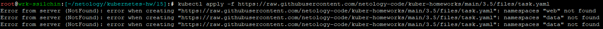
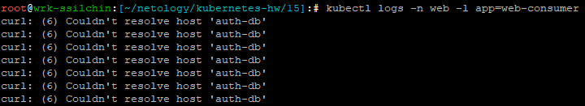
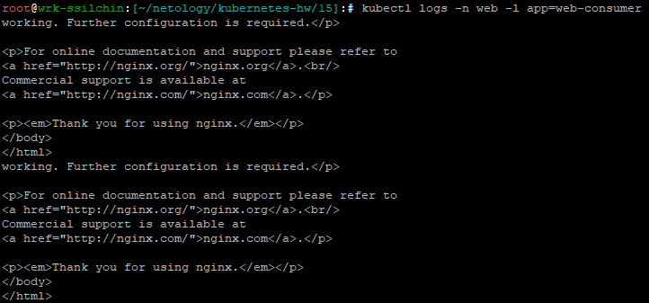

# Домашнее задание к занятию Troubleshooting Крюков Николай Сергеевич

### Цель задания

Устранить неисправности при деплое приложения.

### Чеклист готовности к домашнему заданию

1. Кластер K8s.

### Задание. При деплое приложение web-consumer не может подключиться к auth-db. Необходимо это исправить

1. Установить приложение по команде:
```shell
kubectl apply -f https://raw.githubusercontent.com/netology-code/kuber-homeworks/main/3.5/files/task.yaml
```
2. Выявить проблему и описать.
3. Исправить проблему, описать, что сделано.
4. Продемонстрировать, что проблема решена.

### Решение  

1. Чтобы приложение установилось, необходимо создать 2 namespace web и data командами

 ```kubectl create namespace web```

 и 

```kubectl create namespace data```

 иначе при установке возникнет ошибка об их отсутствии:

  

2. Проблема заключается в том, что под web-consumer из неймспейса web пытается обращаться к сервису auth-db в неймспейсе data просто по имени
 
  (```curl auth-db```),

 но это не будет работать, так как по умолчанию kubernetes ищет сервисы в том же неймспейсе, где находится под, который делает запрос. Текущая команда 

```curl auth-db```

 будет искать сервис auth-db в неймспейсе web и не найдет его, так как этот сервис находится в неймспейсе data:



3. Для доступа к сервису в другом неймспейсе нужно использовать полное доменное имя сервиса: auth-db.data.svc.cluster.local, исправим это в

[**task.yaml**](./task.yaml)

4. Убедимся, что после изменения в логе контенер из namespace web успешно подключился к контейнеру nginx в namespace data командой

 ```kubectl logs -n web -l app=web-consumer```:  



